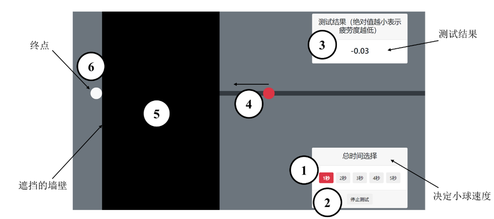

# NUEDC project: Driving Fatigue Real-time Detection and Pre-warning System (Published)

Published in: 2020 NUEDC Information Technology Frontier Invitational Competition: (Renesas Cup) Selected Winning Works


2020 National College Student Electronic Design Contest Information Technology Frontier Topic Invitational Tournament (Risa Cup) works design report

Driving Fatigue Real-time Detection and Pre-warning System

Abstract: The Chinese National Road Traffic Safety Report issued by the Traffic Management Bureau of the Ministry of Public Security of the People’s Republic of my country pointed out that in the major traffic accidents, the driver’s fatigue driving is the most prominent. Driving fatigue will significantly increase the driver’s reaction time, decrease in operating ability and increase in judgment errors. Therefore, it is of practical significance to establish a suitable driving fatigue evaluation system and device.

This work is a fatigue warning system and is based on the Renesas RZ/A2M embedded platform. The visual sensor and the brain wave sensor collect the driver’s facial image and brain wave data respectively, and send the data back to the embedded platform. Through simple processing and calculation, three indicators that characterize driver fatigue are obtained: “Brain Activity”, “Attention”, and “Visual Fatigue Index”. In advance, fatigue threshold corresponding to each indicator are calculated out of the labeled experimental data through classification and regression tree (CART) data mining method, so that the embedded system can quickly and accurately judge whether the driver’s in fatigue.

With the help of the built-in edge computing unit DRP in the RZ/A2M embedded chip, we optimize the processing of the driver’s facial image by accelerating the calculation of fatigue indicators with DRP. In addition, the system accesses the Alibaba Cloud IoT platform by the ESP32 module through WIFI. In real time, the system uploads the detection results and warning information to the cloud, and monitors the operating status. This mechanism facilitate the networking, data collecting, and firmware upgrading of a large amount of devices.The system can accurately judge driving fatigue and issue warnings in time, and has a cloud recording function. In addition to driving fatigue monitoring applied to motor vehicle drivers, application scenarios also include scenarios that require instant response, such as high-speed rail and ship unloaders.

Keywords:Renesas RZ/A2M; Vision Sensor; Brainwave Sensor; Edge Computing; Dynamically Reconfigurable Processor (DRP); Classification And Regression Tree Data Mining; Alibaba Cloud IoT Platform; Instant Response;

## 1.1 Background Analysis

The Virginia Tech Transportation Institute has published a set of survey data on driver habits, distractions, and crash causes. The data show that nearly 80% of collisions and 65% of impending collisions are caused by driver negligence in the 3s before the incident. Therefore, implementing real-time fatigue detection during driving and generating alerts quickly and effectively is an important tool to avoid accidents.

## 1.2 Related work

The system is based on Renesas RZ/A2M embedded platform, and the fatigue detection function is realized by the scheme of combining EEG physiological indicators with iris detection technology.

### 1) Fatigue determination

(1) EEG indicator analysis. Two indicators are used to determine fatigue in this work, which are "brain activity" and "concentration". The "brain activity" (EEGCV) is essentially the ratio of the variance to the mean of the EEG signal in each assessment period, i.e., the EEG coefficient of variation. Concentration" is an indicator derived from the built-in algorithm in the EEG chip TGAM, which has some reference value.

(2) Iris detection technology. In this work, the driver's iris position and state are detected to infer the driver's fatigue state by detecting the eye-movement characteristics, and the image processing process is accelerated by the dynamic configurable processor DRP.

(3) Fatigue threshold determination and application scheme. To determine the threshold, data mining was used to find the best cut-off point in 1541 collected data sets using Classification and Regression Tree (CART) data mining method. The results of the dichotomous classification were: normal vs. fatigue.

### 2) Cloud system solution

Ali cloud IOT platform access: embedded platform through the ESP32 module WIFI function to access the Internet, and then able to access the Ali cloud IOT platform, in this platform for data display, record. On the basis of this IOT data access, we used the IoTStudio tool provided by AliCloud IOT platform to create a web application as the data display window of this work, which can be accessed directly through a browser, thus monitoring the real-time data status and real-time curve.

### 3) Hardware devices communicate with each subsystem

The vision sensor uses the IMX219PQH5-C camera from the development kit, which is connected to the Renesas RZ/A2M embedded platform via the MIPI interface. The EEG sensor uses the MindLink EEG sensor based on the TGAM chip, which is connected to the serial port 1 of the ESP32 using Bluetooth to serial communication. The EEG data is parsed and passed to the SCIFA4 serial port of the RZ/A2M via the serial port 2 of the ESP32.

## 1.3 Description of features

(1) Immediacy. The detection period is 1s, i.e. a data set consisting of three indicators is output every second in the system.

(2) Indicator integration. The system uses multiple indicators and integrates physiological and visual indicators to assess the degree of fatigue, effectively avoiding misjudgment caused by single indicator abnormalities and making the system more robust.

(3) Long-term monitoring capability. Local data is isolated and inflexible, which is not convenient for analysis of big data. In this work, the data is regularly packaged and uploaded to Aliyun IOT platform. With a certain amount of data, further mining and analysis is carried out to get a longer period of time span view of the driver's fatigue at work.

## 1.4 Application prospect analysis

Application areas can be in places where the immediate response of drivers is high, such as charter buses engaged in tourism and road-specific vehicles transporting dangerous chemicals. In addition to the application of driving fatigue monitoring for motor vehicle drivers, the application scenarios of this work include, for example, scenarios requiring immediate driver response such as high-speed rail and ship unloading machines.

## 2.1 System scheme

### 2.1.1 Background

Fatigue driving refers to the driver's physiological and psychological dysfunctions after a long period of continuous driving, and the phenomenon of objective decline in driving skills. According to the Penalty Standards for Road Traffic Violations, driving a motor vehicle continuously for more than 4h without stopping to rest or stopping to rest for less than 20min constitutes fatigue driving. This work aims to design a device to determine driver fatigue based on Renesas platform and EEG signal and visual sensor analysis, in order to achieve the purpose of real-time monitoring and timely warning reminders, which can greatly reduce the possibility of traffic accidents.

The system is based on Renesas platform development, using multi-source information fusion, is a combination of the Internet of Things, embedded application system, where the hardware part of the development board to control a variety of peripherals to complete a series of operations, including embedded development kit, integrated camera ﹑ Bluetooth communication, power supply module, etc.. The software part completes the face iris detection, feature point circling, fatigue determination alarm and other operations. When driver fatigue is detected within a certain period of time, the system will alarm (ringing) to remind the driver to achieve the role of wake-up call. At the same time, the Ali cloud platform can be used to transmit monitoring data in real time to remind and notify the driver. Finally, the development process and results of the detection system are explained. Theoretical experiments are designed to quantify the driver's fatigue state, and the curve is generated through Ali cloud server, which can visualize the driver's mental state. This system can help the construction of smart city and smart transportation, and has wide applicability.

### 2.1.2 Solution design

The input part of the system is the wearable EEG sensor and the visual sensor fixed in front of the driver, two sensors, which is the basis for the realization of system functions. The processing part in mainly on the RZ/A2M platform. From the EEG data, two indicators are obtained: "EEG activity" and "concentration", and from the visual data, the indicator "visual fatigue" is extracted based on the duration of eye closure. Finally, according to the threshold value obtained in the experiment, the fatigue is judged when and only when all three indicators exceed the threshold value.

The last part of the IOT is to connect with the IOT cloud platform and record data and make alarms. This is connected to the Internet and Ali cloud IOT platform with the WIFI function of ESP32F module. The block diagram of the system is shown in Figure 1 below.


Figure 1 Block diagram of the work system

## 2.2 Implementation principle

### 2.2.1 Detection method based on driver's physiological signal

Research on fatigue first began in physiology. Related research shows that the physiological indicators of people in the state of fatigue will deviate from the normal state. Therefore, the driver's physiological indicators can be used to determine whether the driver is in a state of fatigue.

Researchers have long found that EEG can directly reflect the activity of the brain. When entering a fatigued state, there is a large increase in delta and theta wave activity in the EEG, and a small increase in alpha wave activity. Another study conducted experiments by monitoring EEG signals in a simulator and in a real car, and the results showed that EEG is an effective method for monitoring driver fatigue. ECG has been used primarily in physiological measures of driving burden. Studies have shown that ECG decreases significantly and regularly when drivers are fatigued, and that there is a potential relationship between HRV (heart rate variability) and changes in the level of fatigue while driving. The detection method based on the driver's physiological signal has a high accuracy for fatigue determination, but the physiological signal needs to be measured by contact and is more dependent on the individual, which has many limitations when actually used for driver fatigue monitoring, so it is mainly applied in the experimental stage as a control parameter for experiments [1].

### 2.2.2 Detection method based on the physiological response characteristics of the driver

The detection method based on the physiological response characteristics of the driver refers to the use of the driver's eye movement characteristics and head movement characteristics to infer the driver's fatigue state. Driver's eye movements and blink information are considered to be important features reflecting fatigue, and blink amplitude, blink frequency and average closure time can be directly used to detect fatigue. There are various algorithms for studying driver fatigue based on ocular motility, and widely used algorithms include PERCLOS, which is the percentage of eyelid closure time over a period of time as a measure of physiological fatigue.

The detection of the iris can help determine the state of eye closure. Specifically, after the iris is detected in the first image frame, the iris is tracked in subsequent image frames using the center coordinates and radius of the iris. This is also known as Hough transform circle detection with known radius, and the computational effort is significantly reduced as the dimensionality of the parameter space decreases. And since the center coordinates of the iris in the previous image frame are the reference position, and since the eye is moving and usually the position of the iris changes in the next frame, we delineate a range, i.e., the brow-eye region, within which iris detection is performed. As the range is narrowed, the detection speed is improved. To improve the accuracy of iris tracking in subsequent frames, we also specify that iris tracking is considered complete for the current frame only when both irises are detected. Then, the center coordinates of the iris detected in the current frame are used as the reference position for the next frame, and the iris tracking is proceeded to the next frame. This process will continue unless the iris is not detected or is jumped out of the tracking loop [2].

Iris tracking makes use of the a priori knowledge at the time of iris detection, i.e., it continues to detect the iris circle in the tracking frame using the Hough transform when the iris radius and center coordinates of the previous frame are known. In this way, the computational complexity is greatly reduced and the real-time requirement is satisfied. Eye closure is also a basic human physiological characteristic, and this group of products is judged based on the percentage of time the eyes are closed over a period of time when fatigue status is determined.

### 2.2.3 Cloud platform based on Ali cloud server

Using Ali open source cloud server platform Ali's artificial intelligence ET has the world's leading artificial intelligence technology, already has intelligent voice interaction, image/video recognition, traffic prediction, sentiment analysis and other skills. Through Renesas platform face iris recognition and EEG activity cross-fusion fusion, unified judgment after uploading to the cloud server, car tachometer like real-time display of brain activity, concentration and blink frequency, eye degree and fit the curve, now most cars are deployed in the car screen only through the Bluetooth connection can be realized after the security monitoring function, effective protection of personal safety. The time threshold can be repeatedly set manually, and when the predetermined time is reached, the PERCLOS algorithm is used to determine the driving status of the person. If the state is fatigue, the alarm device will be activated to wake up the driver. If the number of fatigue detected within the set time period exceeds the pre-set threshold, the detection data will be sent to the designated contact person and passenger through the WeChat cloud platform.

## 2.3 Design calculation

### 2.3.1 Median filtering to remove EEG artifacts

Since the EEG signal is very weak, it is easily disturbed by additional noise such as oculoelectric artifacts and myoelectric artifacts introduced from the acquisition equipment etc. The interference components of each artifact noise contained in the EEG signal seriously affect the authenticity of the acquired EEG signal, which makes it very complicated to study the characteristics of the EEG signal and analyze and process it. In order to extract a relatively clean EEG signal, according to the algorithms related to EEG signal processing, the EEG signal de-artifact processing based on the improved wavelet thresholding [3] shrinkage algorithm is better, but due to the complexity of the algorithm and the requirement for computational speed, the median value filtering method is used here instead. The filtering effect is demonstrated as shown in Figure 2.


Fig. 2 Median de-artifactualization effect

### 2.3.1 Fatigue threshold calculation

After proposing the indexes for measuring fatigue, that is, after the system has been processed to derive the three parameters of brain activity, concentration and visual fatigue index, the next thing to do is to determine the threshold value of the fatigue index. The use of the threshold judgment method enables the system to make a quick judgment. In order to obtain accurate interval values for fatigue indicators, a reasonable interval calculation method must be chosen first.

The method of determining the interval value based on the empirical value of the fatigue index at the time the subject reported fatigue is rather coarse, and the interval value of the fatigue index obtained in this way lacks objective theoretical support. The method of determining the interval value of a measure based on the significance of the difference between data segment series is more objective, but in practice, this method is often used to determine how long it takes for a subject to enter a fatigue state to reach a certain state, rather than being used directly to determine the threshold value of a measure.

In order to obtain an accurate fatigue threshold, this work combines subjective and objective data to initially determine fatigue thresholds by classification with the CART method. The Gini index is an important concept in CART. The Gini index (Gini impurity) indicates the probability that a randomly selected sample in the sample set is misclassified.

The classification regression tree using SPSS 22.0 software constructs is shown in Figure 3. It can be seen that the software uses EEGCV = 1.255 as the optimal cut point, which shows that the Gini index of EEGCV is smaller than the Gini index of the concentration parameter. At EEGCV greater than 1.255, the percentage of normal state reaches 99.1%, which is a high accuracy rate. For the concentration parameter, the software gives a division value of 26.5. Therefore, according to the CART classification, two initial Min values of the fatigue index are obtained: EEGCV = 1.255 and concentration parameter = 26.5.


Figure 3 Classification regression tree with threshold selection

## 2.4 Software design

Renesas RZ/A2M embedded platform undertakes most of the computational tasks in the system, including visual information processing, brainwave processing and fatigue judgment.

The three parameters used in the fatigue judgment have thresholds corresponding to them and are judged continuously, and the fatigue alarm is triggered when and only when all three measured parameters exceed the thresholds, and this structure ensures the robustness of the system judgment. The program flow chart is shown in Figure 4


Figure 4 Program flow chart

(Note: The selection of the threshold value for fatigue is not yet completed before the deadline)

## 2.5 Work function

### 2.5.1 Appearance

The CPU board and the slave board of the RZ/A2M development board are in the middle of the picture. The top left side is the camera, which takes the facial image of a human face. On the bottom right is the ESP32-WIFI module with a Bluetooth module connected to receive EEG data. The speaker is placed on top of the ESP module and is driven by the ESP32 on-board driver module. The appearance of the work is shown in Figure 5 below.


Figure 5 Hardware appearance of the work

This hardware can achieve the acquisition and processing of face information, and through the Bluetooth module and brain wave sensor connection, after processing, can achieve the purpose of fatigue detection and voice alarm.

### 2.5.2 Web Application

The team created a corresponding web application through the Aliyun platform IoT Studio to reflect the driver's status in real time into the web application, so that the data can be viewed in real time in the web. In the monitoring interface, we can view the real-time changes of the three indicators and the real-time curve changes, so that we can intuitively see the current status of the driver. Figure 6 below shows (Note: the risk warning section for long-term monitoring is still under development)


Figure 6 Real-time monitoring web application interface display

The content includes the test protocol, as the design of this experiment requires frequent subjective reflections from the tested person, which may cause risks if under real driving conditions. Therefore, the experimenter was asked to perform simple tasks such as text writing and newspaper reading in a quiet and empty room. And under this sedentary condition, EEG and visual data recording and subjective feedback recording were performed for one hour. The sedentary condition ensures both the accuracy and the safety of the experiment. The analysis of the results is based on both the accuracy of recognition and the timeliness of warnings.

## 3.1 Test protocol

Five test subjects in good physiological condition were selected, and all of them had a good sleep time of 8 hours on the day before the experiment. Each experiment was conducted at 9:00-10:00 a.m., 14:00-15:00 p.m. and 22:00-23:00 p.m. During the experiment, the subjects actively reflected their mental status every 3 minutes. The ways of feedback in this experiment include two types, the first one is through questionnaire and the second one is through reaction speed test.

### 3.1.1 Classification of methods for fatigue assessment

The subjective response, as the name implies, is a simple and easy method for the test subject to actively respond to his or her own fatigue state. And not to the observer's personal preferences, experience and change, and therefore this method is called objective assessment method. According to the different levels of objective assessment of brain fatigue, according to the literature [4] objective assessment methods can be distinguished as:

(1) psychological and behavioral indicators: for example, simulated typing, reaction speed assessment, etc.

(2) Physiological indicators: EEG is used for fatigue detection and is known as the "gold standard" [5].

(3) Biochemical index assessment method

In this work, the EEG assessment of physiological indicators was used for real-time detection, and the reaction speed assessment of psychological-behavioral assessment was used in this experiment. The more objective reaction speed assessment was combined with a subjective questionnaire to perform fatigue criteria to verify the accuracy and robustness of the system.

### 3.1.2 Fatigue subjective response

The subjective reflection of fatigue is the subjective perception of fatigue or not by the subject himself during the experiment. Because the objective quantification of fatigue is more difficult, the subjective feeling of the subject is used as the criterion for whether fatigue is present, and the fatigue obtained in this way is more informative as a reference for model correction.

Two ways can be used to obtain the subjective response values of subjects, the first by means of regular questioning and the second by means of questionnaires at regular intervals. Taking into account that the subjects may not admit to having reached fatigue, resulting in inaccurate results of the experiment. In this experiment, questionnaires were used. A score of 4, 3, 2 and 1 was recorded for not conforming, slightly conforming, relatively conforming and fully conforming, respectively, i.e. the lower the score, the greater the fatigue level responded to. The table used for the experiment is shown in Table 1 below:

Table 1 Fatigue questionnaire


### 3.1.2 Objective fatigue detection

There are many ways to evaluate fatigue using an objective approach without the subjective response of the subject, for example, fatigue imbalance fatigue directly affects the driver's safe driving, which is currently a subject of interest to scholars at home and abroad [6]. Another example is that with the help of the measurement of eye movements, for each of the indicators that can be detected in human eye movements, among which the eye movement indicators related to visual fatigue are mainly blinking, focus, eye jump and pupil changes, etc., through which a more objective evaluation of fatigue can be made [7].

However, the detection method as mentioned above has high instrument requirements and is time-consuming, which is not applicable to the higher density of measuring once required in this experiment, and although it is accurate and scientific, it cannot detect the characteristics of the system for real-time detection. Therefore, this test experiment uses the detection of whether the concentration of attention to carry out the objective detection of fatigue.

## 3.2 Test environment construction

### 3.2.1 Installation of the tested equipment

After connecting the circuit cable, the camera of the work is placed 8~15 cm in front of the eyes of the person under test to ensure that the image of the driver's face can be taken. The camera of the work as shown in the figure has been fixed on top of the embedded system board, so it needs to be placed as a whole.

### 3.2.2 Validation environment construction

As the validated data collection for this experiment, as a criterion for fatigue or not, the environment includes the two methods already mentioned in the previous section, the first one is a questionnaire and the second one is a reaction speed detection by behavioral approach.

The questionnaire is printed in sufficient quantity and neatly placed, and the test subject is asked to fill out the questionnaire requiring the test subject to fill out the questionnaire once when the alarm clock goes off and the reaction speed test is performed.

There are still many methods for reaction speed testing, and this experiment takes a simple approach based on an open source project to create the reaction speed testing application shown in the figure, which runs on a browser. Unlike the original project, the application was modified in this experiment by adding the function of averaging, i.e., each test was performed five times in a row, each time for 2 seconds, and the average and variance were obtained. If the variance is large then the reaction speed test will be repeated as a way to ensure the accuracy of the test.

This approach is different from the common reaction, speed test, such as selecting the color fast to calculate the reaction time, etc. The working principle of the application used in this experiment is. At "1" select the ball speed, "2" click start, "4" at the ball will move to the left, when the movement to "5 When the ball reaches the wall blocked by "5", it will not be visible. The test subject will be asked to anticipate when the ball will reach the end point "6" and click the end button to end the measurement. The test subject's judgment error will be displayed at "3", and this value will be used to evaluate the test subject's reaction speed, etc. The test interface is shown in Figure 7 below and is labeled as follows: (1) speed adjustment button, (2) start (stop) button, (3) result display, (4) ball moving to the right, (5) wall hiding the ball, and (6) end point.




Figure 7 Reaction speed test interface

## 3.3 Test Equipment and Data

The equipment in the test chamber consists of two parts, a fixed part and a wearable part. The wearable part is used to measure EEG signals, while the fixed part is used for signal processing and visual signal acquisition. The data recording is done through Renesas' serial port to transfer the data to the computer serial monitor and save it as a table.

### 3.3.1 Test equipment

In this work, data monitoring can be obtained in two ways, the first is through the embedded system supported by the display and serial output for local monitoring of data, the second is directly through the cloud to monitor data and data trends. Here, for convenience, the first one is taken to observe data from the monitor and record data through the serial port. The format of the serial output data is "xx,xx,xx", which is easy to view in the serial monitoring and save as csv format for analysis. Among them, the data packets are, in order, activity, concentration, and visual fatigue index. Among them, activity (EEGCV) is the coefficient of variation of EEG data within the sampling time, the larger it is, the more active it is; concentration ranges from 0-100, the higher it is, the higher the concentration level; visual fatigue index is in ms, which is the blink time of visual detection. The process was recorded by the experimenter, and the subject was asked to concentrate on what he or she was doing. The data recorded by the monitor include brain activity, concentration level, and visual fatigue index, and a warning message is provided, as shown in Figure 8.


Figure 8 Data displayed by the monitor

### 3.3.1 Data recording

The data is obtained among the records with an interval of 3min and a duration of 1h. The data is displayed on the AliCloud platform. As shown in Figure 9, there are obvious fluctuations visible. Subjective feedback scores as the standard of fatigue, less than half of the score, that is, 14 points, will be obtained, and the reaction speed test is used as a reference to ensure that the tested personnel have not disguised the fact that they have been fatigued. (Note: Since the relevant functions have not been completed yet, the apparent fatigue is simulated data at this time.)


Figure 9 Data graphs in the validation experiment (web application)

The three subjects were tested at different times of the day and the data obtained were collated as shown in Table 2.

Table 2 Data collation records of the three test subjects


## 3.4 Analysis of results

The accuracy rate was analyzed and calculated to obtain that the average accuracy rate reached 73%, which proves that the threshold selection and system functions are able to meet the requirements.

This system - based on the embedded driver fatigue detection cloud system, using a dual way (EEG indicator detection and iris detection technology) that does not interfere with the driver to monitor the driver's fatigue in real time and alert reminders, and real-time data display records through the Aliyun IOT platform, which can further overcome the driver's bad driving habits It can further overcome drivers' bad driving habits and ensure their personal safety.

## 4.1 Main innovation points

### 4.1.1. No interference with the driver's test method

The system is based on Renesas platform through the dynamic configuration of the processor DRP function, can fully realize the requirements of on-board, low power consumption, fast speed, etc., in the driver drowsy, fatigue, head down to play with cell phones and other dangerous driving behavior in the first time to fatigue degree alarm, so as to avoid accidents.

### 4.1.2. Adopt the identification method with high accuracy, high robustness and high reliability: it is not affected by the usage conditions such as wearing glasses and sunglasses during the detection process.

### 4.1.3. Adopt multiple means to alert drivers to avoid poor alerting effect by a single alerting method.

### 4.1.4. Realize intelligent interconnection: visual acquisition based on Renesas RZ/A2M embedded platform, EEG indicator acquisition based on MindLink two interactive communication, combined with physiological indicators and visual indicators to determine the degree of fatigue, to avoid abnormal misjudgment, so that the system has good robustness.

(1) Voice prompts: The announcement tone of the host can be set, and the volume and tone of the prompts will change according to the degree of alarm urgency.

(2) Comprehensive determination: The data integrates "brain activity", "concentration" and "visual fatigue" to form a unified data set output to overcome error-induced misjudgment.

(3) Remote alert: After detecting an alarm, the system will send the information back to the big data cloud, which will send a warning to the client (cell phone, etc.).

(4) Long-term monitoring capability: Local data is isolated and inflexible, which does not facilitate the analysis of big data. In this work, the data will be packaged and uploaded to Ali cloud IOT platform at regular intervals. With a certain amount of data, further mining and analysis is carried out to get a longer period of time span view of the driver's fatigue at work.

## 5.1 Deficiencies and improvements

### 5.1.1 Insufficient iris detection recognition rate

The basic principle of iris detection is that the iris is detected by identifying the location of the two eyes with a rough detection and then performing a circle matching. In order to reduce the difficulty of detection, the location of the detection is limited to a certain range. However, this leads to sensitivity to eye distance from the camera, posture, etc. when recognizing. When conducting real-world tests, it was found that detection was only possible when the eye was about 10 cm directly in front of the camera.

The planned improvement solution is to add a face detector before iris detection to first lock the position of the face and then perform iris detection, which is expected to greatly improve recognition efficiency.

### 5.1.2 Insufficient amount of data in the experiment

In the data mining, only 1K amount of data is used, which makes the reliability or not high. The next step will be to collect EEG and visual data of different drivers in different environments to improve the system stability.

## 5.1 Competition Summary

In this competition, the competition students were not able to participate in the competition together in the field due to the epidemic. The whole process of making, experimenting and debugging took nearly two months, and the progress of the work completion was slow, but the team overcame many difficulties and finally finished the system with certain functions. By the time of submission, there are still functions that have not been debugged, including: the determination of the fatigue threshold of the visual display, face detection mechanism perfection, etc.

## Appendix I MQTT way to connect to Ali cloud platform

```c
WiFiClient espClient;

PubSubClient  client(espClient);

void callback(char *topic, byte *payload, unsigned int length)

{

……

}


void wifiinit () /* connected preset wifi */

{WiFi.mode(WIFI_STA);

WiFi.begin(WIFI_SSID, WIFI_PASSWD);

while (WiFi.status() != WL_CONNECTED)

{delay(1000);

client.setServer(MQTT_SERVER, MQTT_PORT);   /* After connecting to wifi, connect the MQTT server */

client.setCallback(callback); }

}

void mqttCheckConnect()

{/* The MQTT key used to use the correct network is normal and can be connected to the Alibaba Cloud platform, otherwise */

while (!client.connected())

{Serial.println(“Connecting to MQTT Server …”);

if (client.connect(CLIENT_ID, MQTT_USRNAME, MQTT_PASSWD))

{Serial.println(“MQTT Connected!”);}

else{Serial.print(“MQTT Connect err:”);

Serial.println(client.state());

delay(5000);}

}

}

void mqttIntervalPost()                        /* Mqtt protocol to make a post from Alibaba Cloud Server */

{char param[256]; char jsonBuf[256];

sprintf(param,“{\”EEGCV\“:%f,\”Attention\“:%d,\”VisualFatigue\“:%d,\”alarm\“:%d}”, EEGcv,attion,vision_fatigue_index,alarm);

sprintf(jsonBuf, ALINK_BODY_FORMAT, param);

Serial.println(jsonBuf);

boolean d = client.publish(ALINK_TOPIC_PROP_POST, jsonBuf);

Serial.println(d); }

}

```


## Appendix II EEG signal median filtering code

```c
float compare(float *value_buf);       //Medium bubbling method

void mediam_noise(int NUM_process);       //Medium -level filtering for removing noise (ophthalmochemical, ECG)

const int N = 3;//Continuous sampling n times (n to draw the number) for medium -bit value filtering

int i = 0;       //Count variable

const int PROCESSNUM = 512;       //Each filter processing data amount

void mediam_noise(int NUM_process)       //Medium -level filtering for removing noise (ophthalmochemical, ECG)

{       float temp1[PROCESSNUM] = { 0 };

for (int i = 0; i < NUM_process; i++)  temp1[i] = Brain_data[i];//Pay the data to TEMP
for (int j = 0; j < NUM_process - N + 1; j++)

{       temp1[j] = compare(&temp1[j]);

for (i = j + 1; i < j + N; i++)

temp1[i] = Brain_data[i];

}

for (i = 0; i < NUM_process - N + 1; i++)  Brain_data[i] = temp1[i];//TEMP variable copy to data

}

float compare(float *value_buf)       //Medium bubbling method

{for (int ll = 0; ll < N - 1; ll++)           //Bubbling method

{for (int k = 0; k < N - 1 - ll; k++)

{if (*(value_buf + k) >* (value_buf + k + 1))

{float temp = *(value_buf + k);

*(value_buf + k) =* (value_buf + k + 1);

*(value_buf + k + 1) = temp;

}

}

}

return *(value_buf + (N - 1) / 2);

}
```


## References:

[1] Wu Qun. Research on driving fatigue detection method based on ECG and EEG signals [D]. Hangzhou: School of Computer Science and Technology, Zhejiang University, 2008.

[2]Qu Peishu,Dong Wenhui. Human eye state recognition based on eyelid curvature and fuzzy logic. Computer Engineering and Science, 2007, 29(8):50-53.

[3] Zhou N, Li ZM. A clutter suppression method with wavelet domain smoothing filtering [J]. Journal of Electronics, 2010, 38(7):

[4] Mo Xiongqiang. Research on EEG-based fatigue detection method [D]. Yanshan University, 2009.

[5]HU Wenqiang, MA Jin, HAN Wendong. prevention and monitoring means of flying fatigue. chinese Journal of Clinic Rehabilitation,2004,8(3): 542-543

[6] JIN Jian. Research on the mechanism of driving fatigue and the feeder model [D]. Southwest Jiaotong University, 2002.

[7] Huang Yi. Research on visual fatigue evaluation method and application of parallax type 3D display system[D]. Beijing University of Technology,2015.