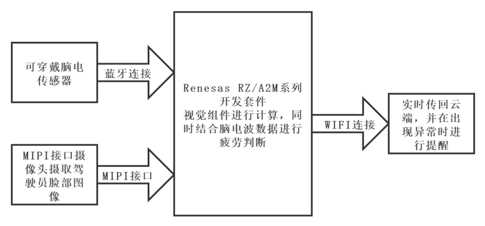
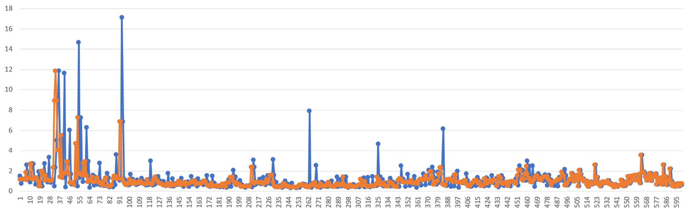
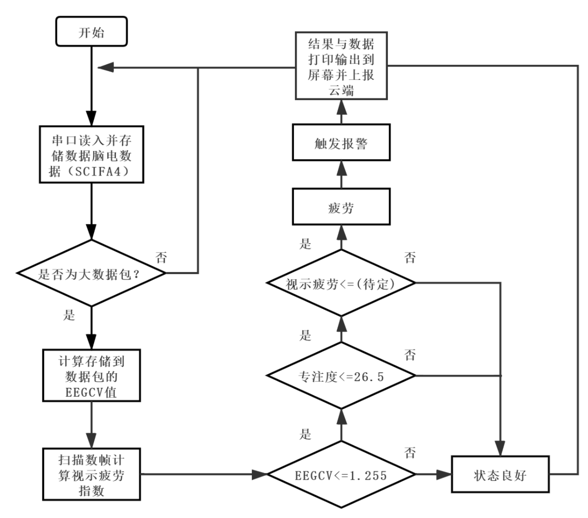
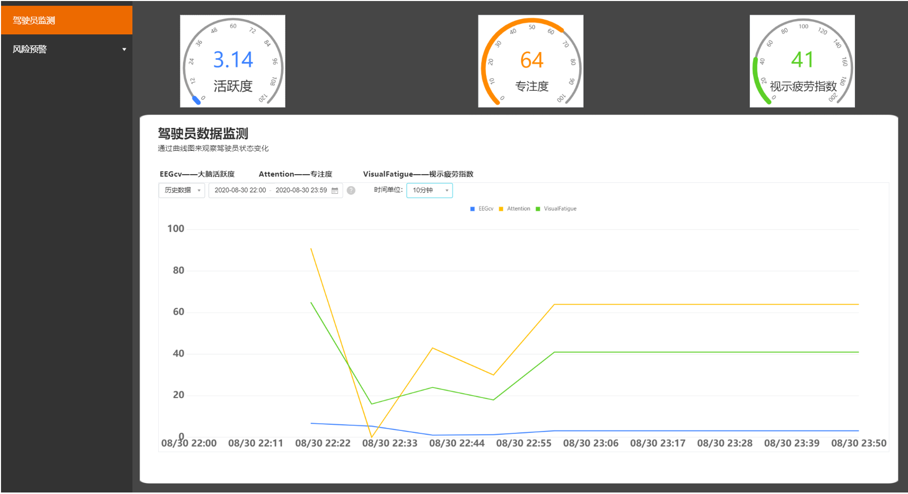
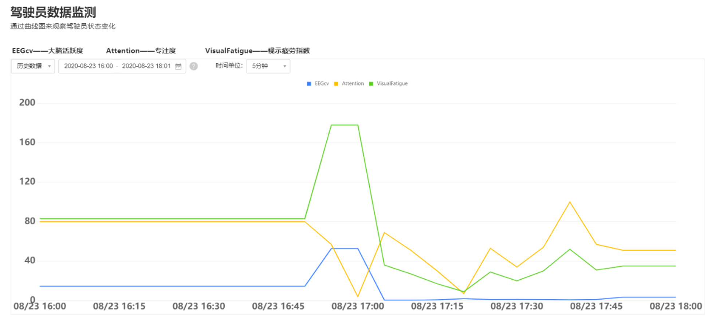

# 全国大学生电子设计竞赛项目：疲劳驾驶检测项目

已经出版于：2020年全国大学生电子设计竞赛信息科技前沿专题邀请赛获奖作品选编


2020年全国大学生电子设计竞赛信息科技前沿专题邀请赛（瑞萨杯）作品设计报告

我国公安部交通管理局发布的全国道路交通安全情况报告指出，在发生的特大交通事故中，以驾驶员疲劳驾驶最突出。驾驶疲劳会使驾驶员的反应时间显著增长、操作能力下降、判断失误增多。因此，建立合适的驾驶疲劳评价体系与装置具有一定现实意义。

本作品为疲劳预警系统，硬件使用瑞萨RZ/A2M嵌入式平台，配合以视觉传感器与脑电波传感器。它们分别采集驾驶员面部图像与脑电波数据，并将数据传回嵌入式平台。通过处理计算得出三个表征驾驶员疲劳度的指标：“脑电活跃度”、“专注度”、“视示疲劳指数”。预先对标注了疲劳的实验数据通过分类与回归树（CART）数据挖掘的方法得到每个指标对应疲劳的阈值，使得嵌入式系统能够快速准确地对驾驶员疲劳程度进行判断。

作品结合RZ/A2M嵌入式芯片内置的边缘计算单元，即动态可配置处理器DRP，对驾驶员面部图像的处理进行了优化，加速了计算疲劳指标的速度。此外，系统通过ESP32模块通过WIFI方式接入阿里云物联平台，将检测结果与警告信息实时上传至云端，能够实时监测运行状态，便于进行大量设备的联网、数据收集、固件升级等工作。能够对驾驶疲劳进行准确判断并及时发出警告，并具有记录云端功能。除应用于机动车驾驶员的驾驶疲劳监测之外，应用场景还包括例如高铁、卸船机等需要驾驶员即时反应的场景。

关键词：瑞萨RZ/A2M嵌入式平台；视觉传感器；脑电波传感器；边缘计算；动态可配置处理器DRP;分类与回归树数据挖掘；阿里云物联平台；即时反应；

## 1.1背景分析

弗吉尼亚理工学院交通运输学院公布了一组关于驾驶员习惯、分心和碰撞原因的调查数据。数据显示将近80%的碰撞，65%即将发生的碰撞是由于驾驶员事发前3s的疏忽造成的。因此，在驾驶过程中实现实时的疲劳检测、快速有效地产生警报是避免事故发生的重要手段。

## 1.2相关工作

本系统基于瑞萨RZ/A2M嵌入式平台，通过脑电生理指标与虹膜检测技术相结合的方案实现疲劳检测的功能。

1）疲劳判断

（1）脑电指标分析。采用两个指标用于本作品中的疲劳判断，分别是“大脑活跃度”与“专注度”。其中“大脑活跃度”（EEGCV）本质上是脑电信号在每个评估时段的方差与均值的比值，即脑电变异系数。而“专注度”是来自脑电芯片TGAM中的内置算法得出的指标，具有一定参考价值。

（2）虹膜检测技术。本作品中通过检测驾驶员虹膜位置、状态以检测眼动特性推断驾驶员的疲劳状态，通过动态可配置处理器DRP加速了图像处理过程。

（3）疲劳阈值确定与应用方案。确定阈值时，使用数据挖掘的方法，在1541条采集到的数据组中，使用分类与回归树（CART）数据挖掘的方法，找到最佳切分点。二分类的结果为：正常与疲劳。

2）云端系统方案

阿里云物联平台的接入：嵌入式平台通过ESP32模块的WIFI功能接入互联网，进而能够接入阿里云物联平台，在此平台进行数据展示、记录。在此物联数据接入的基础上，我们使用阿里云物联平台提供的IoTStudio工具制作了网页应用，作为本作品的数据展示窗口，能够通过浏览器直接访问，从而监测实时数据状态与实时曲线。

3）硬件设备与各子系统通信

视觉传感器使用开发套件中的IMX219PQH5-C摄像头，它通过MIPI接口连接至瑞萨RZ/A2M嵌入式平台。脑电波传感器采用基于TGAM芯片的MindLink脑电波传感器，使用蓝牙转串口的通信方式与ESP32的串口1连接，脑电数据经过解析后经由ESP32的串口2传递至RZ/A2M的SCIFA4串口。

## 1.3特色描述

（1）即时性。检测周期为1s，即系统中每一秒都有一组由三个指标组成的数据组输出。

（2）指标综合。本系统使用使用多个指标，综合考虑生理指标与视觉指标评估疲劳程度，有效避免由单个指标异常所导致的误判，使得系统鲁棒性更好。

（3）长期监测能力。本地数据孤立且不灵活，不便于进行大数据的分析。本作品中将数据定时打包上传至阿里云物联平台。在有一定量的数据的情况下，进行进一步挖掘分析，得到一段较长时间跨度视角下的驾驶员在工作中的疲劳情况。

## 1.4应用前景分析

应用领域可以在从事旅游的包车和运输危险化学品的道路专用车辆等对驾驶员的即时反应较高的地方。除应用于机动车驾驶员的驾驶疲劳监测之外，本作品应用场景还包括例如高铁、卸船机等需要驾驶员即时反应的场景。

## 2.1系统方案

### 2.1.1背景

疲劳驾驶是指驾驶人在长时间连续行车后，产生生理机能和心理机能的失调，而在客观上出现驾驶技能下降的现象。根据《道路交通违法行为处罚标准》，连续驾驶机动车超过4h未停车休息或者停车休息时间少于20min则构成疲劳驾驶。本作品旨在设计基于瑞萨平台及EEG信号与视觉传感器分析的判断驾驶员疲劳度的装置，以实现实时监测的目的并及时发出警告提醒，能够大大降低发生交通事故的可能。

本系统基于瑞萨平台开发，采用多源信息融合，是一个将物联网、嵌入式相结合的应用系统,其中硬件部分利用开发板控制各种外设完成一系列操作,包括嵌入式开发套件、集成摄像头﹑蓝牙通信、电源模块等。软件部分完成了人脸虹膜检测、特征点圈注﹑疲劳判定报警等操作。在一定时间段内检测到驾驶人员疲劳时,系统便进行报警(响铃)，提醒驾驶人员以实现警醒作用。同时还可利用阿里云平台实时传递监测数据,提醒并通知驾驶员。最后，对检测系统的开发过程及成果做出说明理论设计相关实验，对驾驶员的疲劳状态进行量化，后通过阿里云服务器生成曲线，能够形象直观了解到驾驶员精神状态。本系统可以助力于智慧城市、智慧交通的建设,具有广泛的适用性。

### 2.1.2方案设计

系统输入部分是可穿戴脑电传感器与固定在驾驶员前方的视觉传感器，两个传感器，这是系统功能的实现的基础。处理部分在主要在RZ/A2M平台上。从脑电数据中得到两指标:“脑电活跃度”与“专注度”，从视觉数据中，根据闭眼时间长短，提取出“视示疲劳”指标。最后根据在实验中得出的阈值，判断是否疲劳，当且仅当三个指标均超过阈值时判定为疲劳。

最后的物联部分是与物联云平台的连接并记录数据、进行报警等。这都借助ESP32F模块的WIFI功能连接到互联网并与阿里云物联平台连接。作品系统框图如下图1所示。





图1 作品系统框图

## 2.2实现原理

### 2.2.1基于驾驶人生理信号的检测方法

针对疲劳的研究最早始于生理学。相关研究表明，人在疲劳状态下的生理指标会偏离正常状态。因此可以通过驾驶员的生理指标来判断驾驶人是否进入疲劳状态。

研究人员很早就已经发现EEG能够直接反映大脑的活动状态。在进入疲劳状态时，EEG中的delta 波和theta 波的活动会大幅度增长，而alpha波活动会有小幅增长。另一项研究通过在模拟器和实车中监测EEG信号，进行试验，结果表明EEG对于监测驾驶人疲劳是一种有效的方法。同时发现，EEG信号特征有很大的个人差异，如性别和性格等，同时也和人的心理活动相关很大。ECG主要被用于驾驶负担的生理测量中。研究表明在驾驶人疲劳时ECG，会明显的有规律的下降,并且HRV（心率变化）和驾驶中的疲劳程度的变化有潜在的关系。基于驾驶人生理信号的检测方法对疲劳判断的准确性较高，但生理信号需要采用接触式测量，且对个人依赖程度较大，在实际用于驾驶人疲劳监测时有很多的局限性，因此主要应用在实验阶段，作为实验的对照参数[1]。

### 2.2.2基于驾驶人生理反应特征的检测方法

基于驾驶人的生理反应特征的检测方法是指利用驾驶人的眼动特性、头部运动特性等推断驾驶人的疲劳状态。驾驶人眼球的运动和眨眼信息被认为是反映疲劳的重要特征，眨眼幅度、眨眼频率和平均闭合时间都可直接用于检测疲劳。基于眼动机理研究驾驶疲劳的算法有很多种，广泛采用的算法包括PERCLOS，即将眼睑闭合时间占一段时间的百分比作为生理疲劳的测量指标。

对虹膜的检测可帮助判定眼睛的闭合状态。具体就是在第一帧图像中检测到虹膜后，在其后的图像帧中利用虹膜的中心坐标和半径跟踪虹膜。也就是已知半径的Hough变换圆检测，随着参数空间维度的降低，计算量也明显降低了。且以上一帧图像中虹膜的中心坐标为参考位置，由于眼睛是运动的，通常在下一帧中虹膜的位置会发生变化，我们就划定一个范围，即眉眼区域，在这个区域内进行虹膜检测。由于缩小了范围，提高了检测速度。为了提高后续帧中虹膜跟踪的准确性，我们还规定只有当两个虹膜都被检测到时，才算完成当前帧的虹膜跟踪。然后，以当前帧中检测到的虹膜中心坐标为下一帧的参考位置，进入下一帧的虹膜跟踪。这个过程将一直进行下去，除非未检测到虹膜，或从跟踪循环中跳出[2]。

虹膜跟踪利用了虹膜检测时的先验知识，即在上一帧虹膜半径和中心坐标已知的情况下，继续用Hough变换的方法在跟踪帧中检测虹膜圆。这样，大大降低了计算复杂度，满足了实时性要求。闭眼也是人的基本生理特征，本组品在疲劳状态判定时是根据一段时间内眼睛的闭合时间所占的百分比来判断的。

### 2.2.3基于阿里云服务器的云端平台

采用阿里开源的云端服务器平台阿里的人工智能ET拥有全球领先的人工智能技术，已具备智能语音交互、图像/视频识别、交通预测、情感分析等技能。通过瑞萨平台的人脸虹膜识别及脑电EEG活跃度交叉融融合，统一判断后上传到云端服务器，汽车转速表一样实时显示大脑活跃度、专注度以及眨眼频率、眼睛程度等并拟合曲线，现大多汽车都部署车内屏幕只需通过蓝牙连接后便可实现安全监控功能，有效保障人身安全。可手动重复设定时间阈值,当达到预定时间后,利用PERCLOS算法判定人的驾驶状态。若为疲劳状态,则启动警报装置,警醒驾驶员,如果在设定时间段内检测到疲劳次数超过预先设定的阈值后，会将检测数据通过微信云平台发送到指定联系人和乘客手中。

## 2.3设计计算

### 2.3.1中位值滤波去除脑电伪迹

由于脑电信号非常微弱，在采集过程中很容易受到来自采集设备等引入的眼电伪迹、肌电伪迹等附加噪声干扰，干扰成分中的各伪迹噪声包含在脑电信号中严重影响了采集到的脑电信号的真实性，这使得我们在研究脑电信号的特征并对其进行分析处理变得十分复杂。为了提取到相对干净的脑电信号，根据脑电信号处理相关算法，基于改进小波阈值[3]收缩算法的脑电信号去伪迹处理效果较好，但由于算法的复杂度与对计算速度的要求，这里改用中位值滤波的方法。滤波效果展示如图2所示。




图2 中位值去伪迹效果

### 2.3.1 疲劳度阈值计算

在提出了测量疲劳度的指标后，也就是在系统处理后，得出了大脑活跃度、专注度以及视示疲劳指数三个参数，接下来要做的便是确定疲劳指标的阈值。采用阈值判断的方法能够使系统快速判断。为了获得准确的疲劳指标间值，首先要选择合理的间值计算方法。

根据受试者报告疲劳时的疲劳指标经验值来确定间值的方法比较粗类，这样得到的疲劳指标间值缺乏客观理论的支撑。根据数据段系列之间差异的显著性来确定测量指标间值的方法虽然比较客观，但在实际应用中，该方法常用于确定达到某一状态所需受试者经过多长时间进入疲劳状态，而不是直接用于确定测量指标的阈值。

为了得到一个准确的疲劳阈值，本作品结合主、客观数据，通过分类与CART法初步确定疲劳阈值。基尼指数是CART中的重要概念。基尼指数（Gini不纯度）表示在样本集合中一个随机选中的样本被分错的概率。

使用SPSS22.0软件构件的分类回归树如图3所示。可以看到，软件以EEGCV = 1.255 为最优切分点，可见 EEGCV的基尼指数小于专注度参数的基尼指数。在 EEGCV大于 1.255 时，正常状态的比例达到了99.1%，准确率较高。对于专注度参数，软件给出的划分值为 26.5。因此，根据 CART 分类，得到疲劳指标的两个初始闽值: EEGCV=1.255，专注度参数=26.5。


图3 阈值选取的分类回归树

## 2.4软件设计

瑞萨RZ/A2M嵌入式平台承担了系统中绝大多数的计算任务，包括视觉信息处理、脑电波处理与疲劳度判断。

其中疲劳度判断中运用的三个参数均有阈值与之相对应，连续判断，当且仅当三个衡量参数均超过阈值，才会触发疲劳报警，这种结构确保了系统判断的稳健性。程序流程图如图4所示




图4程序流程图

（注：视示疲劳的阈值选取在截稿前暂未完成）

## 2.5作品功能

### 2.5.1外观

图片正中为RZ/A2M开发板的CPU板与从板。左上侧为摄像头，摄取人脸面部图像。右下角为ESP32-WIFI模块，并连接了蓝牙模块以接受脑电数据。扬声器置于ESP模块之上，被ESP32板载驱动模块所驱动。作品外观图如下图5 所示。


图5 作品硬件外观展示

借助这一硬件能够实现对人脸信息的获取与处理，并通过蓝牙模块与脑电波传感器连接，在进行处理过后，能够达到疲劳检测与语音告警的目的。

### 2.5.2网页应用

团队通过阿里云平台IoT Studio制作了相应的网页应用，将驾驶员的状态实时反映到网页应用当中，使得数据能够实时在网页中查看。在监测界面中能够查看到三指标的实时变化值，并能够查看实时的曲线变化，直观的看到驾驶员当前的状态。如下图6所示（注：用于长期监测的风险预警板块仍在开发中）




图6 实时监测网页应用界面展示

内容包括测试方案，由于本实验的设计需要被测试人员频繁的主观反映，如果在真实的驾驶条件下可能会造成风险。所以实验员被要求在安静空旷的室内进行简单工作，如文字撰写、报刊阅读等。并在此静坐条件下，进行为期一小时的脑电、视觉数据记录与主观反馈记录。静坐条件既可以保证实验的准确度，也能够保证实验的安全。对结果的分析，主要基于识别的准确率、警告及时程度两方面。

## 3.1 测试方案

实验选取五位生理状态良好的被测试员，实验前一天的睡眠时间均良好，达到8小时的标准。每次实验时间为上午9:00-10:00，下午14:00-15:00和晚上22:00-23:00，在实验过程中，受试者每3分钟主动反映一次精神状态。本实验的反馈的途径包括两类，第一类是通过问卷调查，第二类则是通过反应速度测试。

### 3.1.1 疲劳评测的方法分类

主观反应顾名思义，由被测试者主动反应自身的疲劳状态，方法简单易行。而不以观察者的个人喜好、经验而发生变化，因而这种方法被称之为客观评测法。根据对脑力疲劳客观评测的层面不同，据文献[4]可将客观评测法区分为：

（1）心理学、行为学指标评测法：例如模拟打字，反应速度评测等

（2）生理学指标评测法：脑电用于疲劳检测被誉为“金标准”[5]

（3）生化指标评测法

本作品使用了生理学指标评测法中的脑电评测来进行实时检测，并在此实验中使用心理学行为学的评测方式中的反应速度评测。较为客观的反应速度评测与主观的问卷调查结合，进行疲劳度的标准以验证本系统的准确度与鲁棒性等。

### 3.1.2 疲劳主观反应

疲劳主观反映就是在实验过程中，受试者本人的主观感受到的疲劳与否。因为疲劳的客观量化较为困难，所以将受试者的主观感受作为是否疲劳的标准，以这样的方式得到的疲劳度作为模型纠正的参考，更具参考价值。

可以使用两种方式来获得受试者的主观反应值，第一种是通过定时询问的方式，第二种是定期通过调查问卷的方式。顾及受试者可能不会承认已经达到疲劳，造成实验结果不准确。本实验采用问卷调查的方式。不符合、略微符合、比较符合、完全符合分别记4、3、2、1分，即分数越低，所反应的疲劳程度越大。实验所使用的表格如下表1所示：

表1 疲劳问卷调查表


### 3.1.2 疲劳客观检测

不通过被测者的主观反应，使用客观方式评价疲劳的途径有许多，例如疲劳失衡性疲劳直接影响驾驶员的安全行车，这是目前国内外学者关注的课题[6]。又如借助对眼睛运动的测量，针对于人眼运动的各项能够检测到的指标，其中与视疲劳相关的眼部运动指标主要有眨眼、关注点、眼跳和瞳孔变化等，通过这些检测可以对疲劳度做出较为客观的评价[7]。

但如上所提及的检测方法仪器要求高，且耗时较长，不适用于本次实验要求的较高的测量一次的密度，虽然准确科学，但无法对系统的实时检测的特性进行检测。故本次测试实验采用检测注意力是否集中的方式来进行疲劳的客观检测。

## 3.2 测试环境搭建

### 3.2.1 被测设备安装

连接好电路电缆后，将作品摄像头置于被测人员的眼睛前方8~15厘米，以保证能够摄取驾驶员的脸部图像。如图所示作品的摄像头已经固定在了嵌入式系统板之上，故需要将其整体放置。

### 3.2.2 验证性环境搭建

作为本次实验的验证性的数据采集，作为是否疲劳的标准，环境包括前面前文已提及的两种方法，第一种是问卷调查，第二种是通过行为学方式进行反应速度检测。

将调查问卷打印足够数量并整齐摆放，要求被测试者填写要求测试者在闹钟响起时，就需要填写一次问卷，并进行反应速度测试。

对于反应速度测试的方法仍有许多，本次实验采取一种简单的方式，基于一开源项目，制作了如图所示的反应速度测试应用，该应用运行于浏览器。不同于原项目的是，本次实验中对应用进行了修改，增加了求取平均的功能，即每次测试连续进行5次，每次2秒，求取平均值与方差。若方差较大则将重新进行反应速度测试，以此保证测试的准确度。

这一方式不同于常见的反应，速度测试，例如选取颜色快来计算反应时间等。在本次实验中所使用的应用工作原理是。在“1”处选择小球速度，“2”处单击开始后，“4”处的小球将向左运动，当运动到“5”遮挡的墙壁后，将会看不到小球。被测者会被要求预计小球何时到达终点“6”处，并单击结束键结束测量，测试者的判断误差将显示在“3”处，依照这一数值来评估被测者的反应速度等。测试界面如下图7 所示，其标示如下：（1）速度调整按钮、（2）开始(停止)按钮、（3）结果显示、（4）向右运动的小球、（5）隐藏小球的墙壁、（6）终点。


图7 反应速度测试界面

## 3.3 测试设备与数据

测试室的设备包括两部分，分别是固定部分和可穿戴的部分。可穿戴设备部分用于测量脑电信号，固定部分则用于信号处理与视觉信号采集。数据记录则通过瑞萨的串口将数据传递到电脑串口监视器，并另存为表格。

### 3.3.1 测试设备

本作品中，数据的监测可以通过两方面来获取，第一种是通过嵌入式系统所支持的显示器与串口输出用于在本地监测数据，第二种是直接通过云端监测数据与数据变化趋势。这里为了方便采取第一种，从显示器观察数据并通过串口记录数据。串口输出数据格式为“xx,xx,xx”形式，便于在串口监视中查看并保存为csv格式，便于分析。其中，数据包中按照顺序分别是，活跃度、专注度、视示疲劳指数。其中，活跃度（EEGCV）为采样时间内脑电数据的变异系数，越大代表其活跃程度越高；专注度范围0-100，越高代表专注等级越高；视示疲劳指数单位为ms，为视觉检测的眨眼时间。过程中由实验人员记录，被测人员被要求专心与所要做的事情。显示器所记录的数据包括大脑活跃程度、专注度、视示疲劳指数，并会提供警告信息，如图8所示。


图8 显示器所显示的数据

### 3.3.1 数据记录

在间隔为3min，持续时间为1h的记录当中，得到数据。阿里云平台上的数据展示。如图9所示，可见有明显波动。主观反馈分数作为疲劳的标准，低于一半的分值即14分，将得到，反应速度测试则作为参考，确保被测试人员没有掩饰已经疲劳的事实。(注:由于暂未完成相关功能，此时视示疲劳为模拟数据。




图9 验证实验中的数据曲线图（网页应用）

被测试者三位在一天中不同时段测试，得到的数据整理后如表2所示。

表2 三位被测试者数据整理记录


## 3.4 结果分析

对准确率进行分析，计算后得到，平均准确率达到73%，证明阈值选取、系统功能均能够达到要求。

本系统——基于嵌入式的驾驶员疲劳检测云系统，采用对驾驶人不产生干扰的双重方式(脑电指标检测及虹膜检测技术)对驾驶员进行实时疲劳度监测并警报提醒，并实时通过阿里云物联平台进行数据显示记录，可进一步克服驾驶员驾驶陋习，确保其人身安全。

## 4.1主要创新点

### 4.1.1. 对驾驶人不产生干扰的测试方式

本系统基于瑞萨平台通过动态配置处理器DRP功能，能完全实现车载、低功耗、速度快等要求，在驾驶员发生瞌睡、疲倦、低头玩手机等危险驾驶行为的第一时间进行疲劳度警报，从而避免事故的发生。

### 4.1.2.采用高精度、高鲁棒性、高可靠性的识别方法：在检测过程中不受佩戴眼镜、墨镜等使用条件的影响。

### 4.1.3.采用多种手段对驾驶员进行提醒，避免单一的提醒方式警醒效果不佳。

### 4.1.4.实现智能互联：视觉采集基于瑞萨RZ/A2M嵌入式平台，脑电指标采集基于MindLink二者交互通信，结合生理指标和视觉指标综合判定疲劳程度，避免异常误判，使系统具有良好鲁棒性。

（1）语音提示：可设置主机的播报提示音，根据报警紧急程度，提示音音量及语气伴随变化。

（2）综合判定：数据综合“大脑活跃度”“专注度”“视觉疲劳”三者形成数据组统一输出，克服误差引起的错误判定。

（3）远程提醒：检测到警报之后，系统将信息回传至大数据云端，云端会向客户端（手机等）发送警告。

（4）长期监测能力：本地数据孤立且不灵活，不便于进行大数据的分析。本作品中将数据定时打包上传至阿里云物联平台。在有一定量的数据的情况下，进行进一步挖掘分析，得到一段较长时间跨度视角下的驾驶员在工作中的疲劳情况。

## 5.1 不足与改进

### 5.1.1虹膜检测识别率不足

虹膜检测的基本原理是，用粗略的检测方式识别两个眼睛所在位置，再进行圆匹配，从而检测到虹膜。为了降低检测难度，将检测的位置限定在了一定范围内。但是这就导致了识别时对眼睛距摄像头距离、姿态等敏感。进行实机测试时发现，仅当在眼睛距离摄像头10cm左右的正前方时，才能够正常检测。

规划的改进方案为，在虹膜检测之前加入一个人脸检测器，首先锁定人脸的位置，再进行虹膜检测，预计这将大大提升识别效率。

### 5.1.2实验中数据量不足

在数据挖掘中，仅使用1K量级的数据，这使得可靠性或不高。下一步将收集不同环境下的不同驾驶员的脑电、视觉数据，以提高系统稳定性。

## 5.1竞赛总结

本次竞赛中由于疫情原因，竞赛同学没能在实地一起参与比赛。整个过程制作、实验与调试过程历经了近两个月，作品完成度进展缓慢，但团队克服了诸多困难，终于完成了具有一定功能的系统。截止交稿时，仍有功能未调试完成，包括：视示疲劳阈值的确定，人脸检测机制完善等。

附录一 MQTT方式连接阿里云平台

```c
WiFiClient espClient;

PubSubClient  client(espClient);

void callback(char *topic, byte *payload, unsigned int length)

{

……

}

void wifiInit()              /* 连接预置好的WIFI */

{WiFi.mode(WIFI_STA);

WiFi.begin(WIFI_SSID, WIFI_PASSWD);

while (WiFi.status() != WL_CONNECTED)

{delay(1000);

client.setServer(MQTT_SERVER, MQTT_PORT);   /* 连接WiFi之后，连接MQTT服务器 */

client.setCallback(callback); }

}

void mqttCheckConnect()

{/* 保证使用的MQTT密钥正确网络正常，能连接到阿里云平台，否则重连 */

while (!client.connected())

{Serial.println(“Connecting to MQTT Server …”);

if (client.connect(CLIENT_ID, MQTT_USRNAME, MQTT_PASSWD))

{Serial.println(“MQTT Connected!”);}

else{Serial.print(“MQTT Connect err:”);

Serial.println(client.state());

delay(5000);}

}

}

void mqttIntervalPost()                        /* MQTT协议向阿里云服务器做一次Post */

{char param[256]; char jsonBuf[256];

sprintf(param,“{\”EEGCV\“:%f,\”Attention\“:%d,\”VisualFatigue\“:%d,\”alarm\“:%d}”, EEGcv,attion,vision_fatigue_index,alarm);

sprintf(jsonBuf, ALINK_BODY_FORMAT, param);

Serial.println(jsonBuf);

boolean d = client.publish(ALINK_TOPIC_PROP_POST, jsonBuf);

Serial.println(d); }

}
```

附录二 脑电信号中值滤波代码

``` c
float compare(float *value_buf);       //中位冒泡法

void mediam_noise(int NUM_process);       //中位值滤波，用于去除噪声（眼电、心电）

const int N = 3;//连续采样N次（N取奇数）进行中位值滤波

int i = 0;       //计数变量

const int PROCESSNUM = 512;       //每次滤波处理的数据量

void mediam_noise(int NUM_process)       //中位值滤波，用于去除噪声（眼电、心电）

{       float temp1[PROCESSNUM] = { 0 };

for (int i = 0; i < NUM_process; i++)  temp1[i] = Brain_data[i];//装载数据到temp

for (int j = 0; j < NUM_process - N + 1; j++)

{       temp1[j] = compare(&temp1[j]);

for (i = j + 1; i < j + N; i++)

temp1[i] = Brain_data[i];

}

for (i = 0; i < NUM_process - N + 1; i++)  Brain_data[i] = temp1[i];//temp变量复制到data

}

float compare(float *value_buf)       //中位冒泡法

{for (int ll = 0; ll < N - 1; ll++)           //冒泡法

{for (int k = 0; k < N - 1 - ll; k++)

{if (*(value_buf + k) >* (value_buf + k + 1))

{float temp = *(value_buf + k);

*(value_buf + k) =* (value_buf + k + 1);

*(value_buf + k + 1) = temp;

}

}

}

return *(value_buf + (N - 1) / 2);

}
```

## 参考文献：

[1]吴群．基于心电、脑电信号的驾驶疲劳检测方法研究[D]．杭州：浙江大学计算机科学与技术学院，2008．

[2]曲培树,董文会.基于眼睑曲率及模糊逻辑的人眼状态识别.计算机工与科学，2007，29(8):50-53.

[3]周宁，李在铭．一种小波域平滑滤波的杂波抑制方法[J]．电子学报，2010，38(7)：

[4]莫雄强. 基于脑电的疲劳度检测方法研究[D].燕山大学,2009.

[5]HU Wenqiang, MA Jin, HAN Wendong. Prevention and monitoring means of flying fatigue. Chinese Journal of Clinic Rehabilitation,2004,8(3): 542-543

[6]金键. 驾驶疲劳机理及馈选模式研究[D].西南交通大学,2002.

[7]黄毅. 视差型三维显示系统视觉疲劳度评测方法及应用的研究[D].北京理工大学,2015.